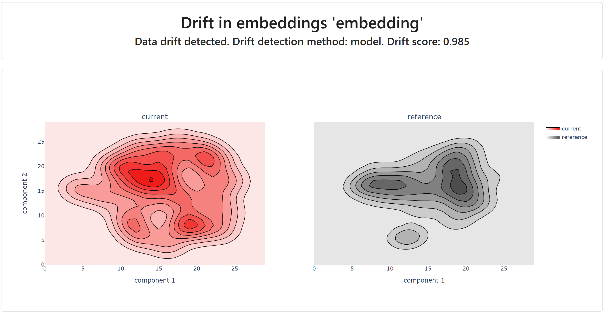
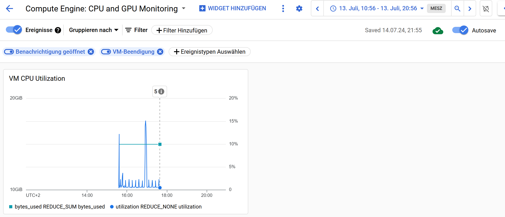

# Monitoring

Summary:

We implemented monitoring for data drift of our textual data (also in form of their embedding values) and label distribution coming from a reference database and a monitoring database originating from our inference app. The report can be accessed via a FastAPI application that creates reports and also downloads them.

For the inference app, we collect a broad set of metrics via the prometheus package. Most of the metrics are coming from a default setting, and one metric (number of made predictions) is manually implemented via incremention steps. If wished, the metrics can be accessed through a metrics/ endpoint in our inference FastAPI app.

On Google Cloud Platform, we tested the usability of the Monitoring Dashboard and created a widget for the CPU utilization and GPU RAM usage. We also created an alert system for a heavy request load to our Google Cloud Buckets, which was triggered once for now.

We added SLO to the Cloud Run "backend" to check the latency of the response, requiring that 80% of reponses must be completed in max 5 seconds. We are also able to stress test our API using locust, spawning multiple users and requests at the same time.

## Data Drift

When we make predictions in your Inference App (wether deployed via Google Cloud or locally), we append all instances in a [monitoring_db.csv](https://console.cloud.google.com/storage/browser/_details/mlops-lmu-data-bucket/data/monitoring/monitoring_db.csv?pageState=(%22StorageObjectListTable%22:(%22f%22:%22%255B%255D%22))&project=mlops-fakenews&supportedpurview=organizationId,folder,project) in `mlops-lmu-data-bucket/monitoring`. This is our so called "current" data base. This is compared in the data drift reports with the "reference" data base, which is the predict.csv, a generated csv from our clean data set. You have the option to to set a filter of what instances of these data sets you want to include in the reports, you can either filter based on the time stamp or number of instances included. The default is to take the last 50 instances of both sets.

### Data Drift Report

[data_drift_report.html](https://console.cloud.google.com/storage/browser/_details/mlops-lmu-data-bucket/reports/monitoring/data_drift_report.html?pageState=(%22StorageObjectListTable%22:(%22f%22:%22%255B%255D%22))&project=mlops-fakenews&supportedpurview=organizationId,folder,project)

In Data Drift Report, you can find the data set summary, missing data summary (non applicable for your data set currently), dataset correlations, dataset drift overview (of all columns, including embedding columns), embedding drift, and data set metrics. As the embedding values take lots of space, the report is much larger then the other two reports.

### Data Drift Test

[data_drift_tests.html](https://console.cloud.google.com/storage/browser/_details/mlops-lmu-data-bucket/reports/monitoring/data_drift_tests.html?pageState=(%22StorageObjectListTable%22:(%22f%22:%22%255B%255D%22))&project=mlops-fakenews&supportedpurview=organizationId,folder,project)

In the Data Drift Tests Report, you can find some tests about data drift. It includes Number of Empty Rows (success), Column Types (success), Share of Drifted Columns (failed, as embedding features are difted), Number of Drifted Features (failed, as embedding features are difted), and Drift for embeddings (failed, as embedding features are difted).

### Text Drived Metrics

[text_drift_metrics.html](https://console.cloud.google.com/storage/browser/_details/mlops-lmu-data-bucket/reports/monitoring/text_drift_metrics.html?pageState=(%22StorageObjectListTable%22:(%22f%22:%22%255B%255D%22))&project=mlops-fakenews&supportedpurview=organizationId,folder,project)

This is a short version of the Data Drift Report, as we only show metrics of our title column, and therefore also including the embedding values. It has the benefit to be much shorter and having less KB, and but giving the main metrics about our only feature vector.

## Telemetry

For the inference app, we collect a broad set of metrics via the prometheus package. Most of the metrics are coming from a default setting, and one metric (number of made predictions) is manually implemented via incremention steps. If wished, the metrics can be accessed through a metrics/ endpoint in our inference FastAPI app.

## Cloud Monitoring

[Monitoring Dashboard - Compute Engine](https://console.cloud.google.com/monitoring/dashboards/builder/401283ac-71e3-45fa-ada2-1869e0c529f6;startTime=2024-07-13T08:56:08.000Z;endTime=2024-07-13T18:56:08.000Z?project=mlops-fakenews&supportedpurview=organizationId,folder,project&pageState=(%22events%22:(%22active%22:%5B%22CLOUD_ALERTING_ALERT%22,%22VM_TERMINATION%22%5D,%22inactive%22:%5B%5D)))

On Google Cloud Platform, we tested the usability of the Monitoring Dashboard and created a widget for the CPU utilization and GPU RAM usage. We also created an alert system for a heavy request load to our Google Cloud Buckets, which was triggered once for now.

We added SLO to the Cloud Run "backend" to check the latency of the response, requiring that 80% of reponses must be completed in max 5 seconds. We are also able to stress test our API using locust, spawning multiple users and requests at the same time.
