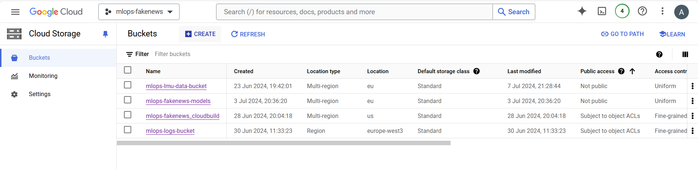
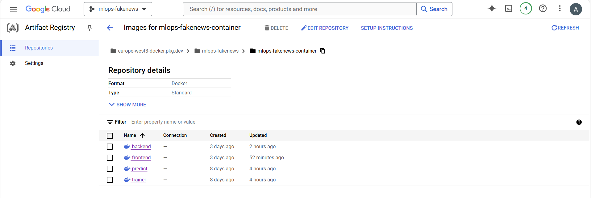
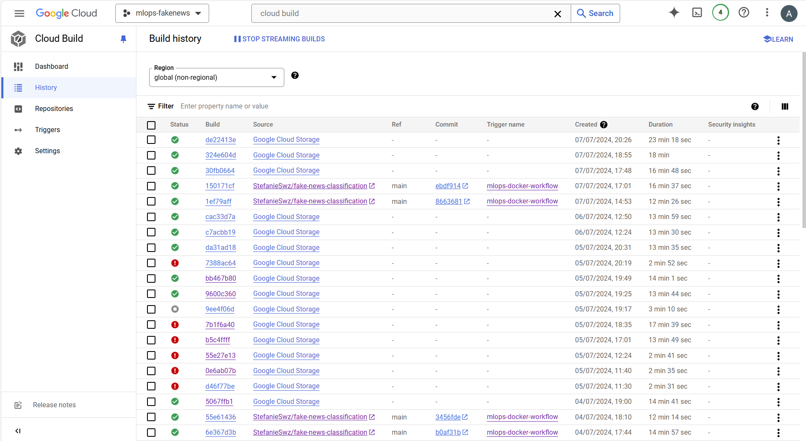

# Exam template for 02476 Machine Learning Operations

This is the report template for the exam. Please only remove the text formatted as with three dashes in front and behind
like:

```--- question 1 fill here ---```

where you instead should add your answers. Any other changes may have unwanted consequences when your report is
auto-generated at the end of the course. For questions where you are asked to include images, start by adding the image
to the `figures` subfolder (please only use `.png`, `.jpg` or `.jpeg`) and then add the following code in your answer:

```markdown

```

In addition to this markdown file, we also provide the `report.py` script that provides two utility functions:

Running:

```bash
python report.py html
```

will generate a `.html` page of your report. After the deadline for answering this template, we will auto-scrape
everything in this `reports` folder and then use this utility to generate an `.html` page that will be your serve
as your final hand-in.

Running

```bash
python report.py check
```

will check your answers in this template against the constraints listed for each question e.g. is your answer too
short, too long, or have you included an image when asked to.

For both functions to work you mustn't rename anything. The script has two dependencies that can be installed with

```bash
pip install click markdown
```

## Overall project checklist

The checklist is *exhaustive* which means that it includes everything that you could do on the project included in the
curriculum in this course. Therefore, we do not expect at all that you have checked all boxes at the end of the project.

### Week 1

* [X] Create a git repository
* [X] Make sure that all team members have write access to the GitHub repository
* [X] Create a dedicated environment for you project to keep track of your packages
* [X] Create the initial file structure using cookiecutter
* [X] Fill out the `make_dataset.py` file such that it downloads whatever data you need and
* [X] Add a model file and a training script and get that running
* [X] Remember to fill out the `requirements.txt` file with whatever dependencies that you are using
* [X] Remember to comply with good coding practices (`pep8`) while doing the project
* [X] Do a bit of code typing and remember to document essential parts of your code
* [X] Setup version control for your data or part of your data
* [X] Construct one or multiple docker files for your code
* [X] Build the docker files locally and make sure they work as intended
* [X] Write one or multiple configurations files for your experiments
* [X] Used Hydra to load the configurations and manage your hyperparameters
* [X] When you have something that works somewhat, remember at some point to to some profiling and see if
      you can optimize your code
* [X] Use Weights & Biases to log training progress and other important metrics/artifacts in your code. Additionally,
      consider running a hyperparameter optimization sweep.
* [X] Use Pytorch-lightning (if applicable) to reduce the amount of boilerplate in your code

### Week 2

* [X] Write unit tests related to the data part of your code
* [ ] Write unit tests related to model construction and or model training
* [X] Calculate the coverage.
* [X] Get some continuous integration running on the GitHub repository
* [X] Create a data storage in GCP Bucket for you data and preferable link this with your data version control setup
* [X] Create a trigger workflow for automatically building your docker images
* [X] Get your model training in GCP using either the Engine or Vertex AI
* [X] Create a FastAPI application that can do inference using your model
* [ ] If applicable, consider deploying the model locally using torchserve
* [X] Deploy your model in GCP using either Functions or Run as the backend

### Week 3

* [ ] Check how robust your model is towards data drifting
* [ ] Setup monitoring for the system telemetry of your deployed model
* [ ] Setup monitoring for the performance of your deployed model
* [ ] If applicable, play around with distributed data loading
* [ ] If applicable, play around with distributed model training
* [ ] Play around with quantization, compilation and pruning for you trained models to increase inference speed

### Additional

* [ ] Revisit your initial project description. Did the project turn out as you wanted?
* [X] Make sure all group members have a understanding about all parts of the project
* [X] Uploaded all your code to github

## Group information

### Question 1
> **Enter the group number you signed up on <learn.inside.dtu.dk>**
>
> Answer:

--- not applicable ---

### Question 2
> **Enter the study number for each member in the group**
>
> Example:
>
> *sXXXXXX, sXXXXXX, sXXXXXX*
>
> Answer:

--- Tobias Brock: 12651637, Anne Gritto: 11946974, Stefanie Schwarz: 12662420 ---

### Question 3
> **What framework did you choose to work with and did it help you complete the project?**
>
> Recommended answer length: 100-200 words.
>
> Example:
> *We used the third-party framework ... in our project. We used functionality ... and functionality ... from the*
> *package to do ... and ... in our project*.
>
> Answer:

--- We used the third-party framework PyTorch, respectively torch lightning in out project. We used functionality ... @ Toby ---

## Coding environment

> In the following section we are interested in learning more about you local development environment.

### Question 4

> **Explain how you managed dependencies in your project? Explain the process a new team member would have to go**
> **through to get an exact copy of your environment.**
>
> Recommended answer length: 100-200 words
>
> Example:
> *We used ... for managing our dependencies. The list of dependencies was auto-generated using ... . To get a*
> *complete copy of our development environment, one would have to run the following commands*
>
> Answer:

--- We used anaconda for managing out dependencies. The list of dependencies was partly auto-generated by pipreqs for packages that are imported explicetly. Other implecitly called dependencies are added manually to the requirements.txt.
To get a complete copy of our development environment, one would have to run the following commands:
conda create -n mlops python==3.11
conda activate mlops
pip install -e .
pip install nvgpu
# ---

### Question 5

> **We expect that you initialized your project using the cookiecutter template. Explain the overall structure of your**
> **code. Did you fill out every folder or only a subset?**
>
> Recommended answer length: 100-200 words
>
> Example:
> *From the cookiecutter template we have filled out the ... , ... and ... folder. We have removed the ... folder*
> *because we did not use any ... in our project. We have added an ... folder that contains ... for running our*
> *experiments.*
> Answer:

--- From the cookiecutter template coockiecutter-datas-science we have filled out everything besides, the docs (mkdocs is an additional part of the project, which would automatically create documentation, the project documentation is in a shared Notion), notebooks (outstanding for model performance visualization), references (not applicable for such a simple model), setup.cfg (as flake8 is included in ruff). We added a config (for using hydra config management) and test folder (for performing unit testing und continuous integration in GitHub). ---

### Question 6

> **Did you implement any rules for code quality and format? Additionally, explain with your own words why these**
> **concepts matters in larger projects.**
>
> Recommended answer length: 50-100 words.
>
> Answer:

--- For code formatting we are using ruff. You can automatically format your code pep8 conform with:
ruff format . # formats all files in directory, respectively
pre-commit run --all-files # as ruff linting and ruff formater are used as precommit hooks
Also every funktion is required a docstring in our repo.
This matters because of readability and automatic documentation (google doc strings). ---

## Version control

> In the following section we are interested in how version control was used in your project during development to
> corporate and increase the quality of your code.

### Question 7

> **How many tests did you implement and what are they testing in your code?**
>
> Recommended answer length: 50-100 words.
>
> Example:
> *In total we have implemented X tests. Primarily we are testing ... and ... as these the most critical parts of our*
> *application but also ... .*
>
> Answer:

--- In total we have implemented 25 tests. Primarily we are testing the data part of the project, especially with make_dataset.py and preprocessing.py, and the model related part, which is aiming at the model.py and train_model.py. The other scripts of the module are mainly consisting of the one function, which is highly entangeled with other services like wandb. The testing is more complex here, since this functionality has to be mocked and can't be tested. ---

### Question 8

> **What is the total code coverage (in percentage) of your code? If you code had an code coverage of 100% (or close**
> **to), would you still trust it to be error free? Explain you reasoning.**
>
> Recommended answer length: 100-200 words.
>
> Example:
> *The total code coverage of code is X%, which includes all our source code. We are far from 100% coverage of our **
> *code and even if we were then...*
>
> Answer:

--- The total code coverage of code is 80%, which includes fakenews\config.py, fakenews\data\make_dataset.py, fakenews\data\preprocessing.py, fakenews\model\model.py, fakenews\model\train_model.py and all init and test files. We are far from 100% coverage of our code as many advanced interaction of functions are wrapped in other functions and are hard to test just like that. Despite that, the base functionality of calculation and processings steps are widely covered by unit tests. ---

### Question 9

> **Did you workflow include using branches and pull requests? If yes, explain how. If not, explain how branches and**
> **pull request can help improve version control.**
>
> Recommended answer length: 100-200 words.
>
> Example:
> *We made use of both branches and PRs in our project. In our group, each member had an branch that they worked on in*
> *addition to the main branch. To merge code we ...*
>
> Answer:

--- We made use of both branches and PRs in our project. In our group, each member created their own branches and worked on distinced feature. Starting from an early stage of the project every branch was only merged through a PR, reviewed by another project member. This highlighted the importance of "Zwei-Augen-Prinziep" as always improvements were implemented through that. We also wanted to include main branch protection rules that our practice was also enforced by GitHub, yet the private accound didn't support that. The continuous integration of unit tests and precommits  is also a form of branch protection. ---

### Question 10

> **Did you use DVC for managing data in your project? If yes, then how did it improve your project to have version**
> **control of your data. If no, explain a case where it would be beneficial to have version control of your data.**
>
> Recommended answer length: 100-200 words.
>
> Example:
> *We did make use of DVC in the following way: ... . In the end it helped us in ... for controlling ... part of our*
> *pipeline*
>
> Answer:

--- We did make use of DVC in the following way: Initially, we used dvc in combination with Google Drive were we stored the version controlled data in form of hashed files. Like that we only pushed data.dvc into github and taged the current data version. We decided to dvc the whole data folder, as we wanted to track all changes and didn't want to have a dvc file inconsistencies. In the end it helped us in saving storage space for controlling changes of part of our data set. ---

### Question 11

> **Discuss you continuous integration setup. What kind of continuous integration are you running (unittesting,**
> **linting, etc.)? Do you test multiple operating systems, Python  version etc. Do you make use of caching? Feel free**
> **to insert a link to one of your GitHub actions workflow.**
>
> Recommended answer length: 200-300 words.
>
> Example:
> *We have organized our continuous integration into 3 separate files: one for doing ..., one for running ... testing*
> *and one for running ... . In particular for our ..., we used ... .An example of a triggered workflow can be seen*
> *here: <weblink>*
>
> Answer:

--- We have organized our continuous integration into 3 separate files: one for doing code formatting and linting with ruff, one for running a docker image on PR and one for testing. In particular for our running the unit tests on the data part, we used a dvc workflow which required storing google drive credentials in GitHub secrets, and is used the test the actual current version of the data related with the PR. An example of a triggered workflow can be seen for the docker image. On PR on main we trigger to built a docker image for training and bush it to docker Hub, which is also enabled with storing the credentials in GitHub secrets. ---

## Running code and tracking experiments

> In the following section we are interested in learning more about the experimental setup for running your code and
> especially the reproducibility of your experiments.

### Question 12

> **How did you configure experiments? Did you make use of config files? Explain with coding examples of how you would**
> **run a experiment.**
>
> Recommended answer length: 50-100 words.
>
> Example:
> *We used a simple argparser, that worked in the following way: Python  my_script.py --lr 1e-3 --batch_size 25*
>
> Answer:

--- We used a simple argparser, that worked in the following way:
python fakenews/model/train_model.py --model.dropout_rate=0.2 --train.batch_size=16 # or
make train ARGS=”train.epochs=5 train.lr=0.01”
as your script is completely automates with make commands.
All configs are handeled by hydra and the defaults are stored in the config folder as yaml files.
Additionally, we can change hydra configs while running docker containers locally:
docker run --name container_name -v %cd%/models:/models/ trainer:latest model.dropout_rate=0.3 train.batch_size=8
---

### Question 13

> **Reproducibility of experiments are important. Related to the last question, how did you secure that no information**
> **is lost when running experiments and that your experiments are reproducible?**
>
> Recommended answer length: 100-200 words.
>
> Example:
> *We made use of config files. Whenever an experiment is run the following happens: ... . To reproduce an experiment*
> *one would have to do ...*
>
> Answer:

--- We made use of config files. Whenever an experiment is run the following happens:
We can change configs over command line inputs. While running the experiment, the configs used are stored in the outputs/ folder, which stores named of the date and time the experiment is run, the configs, hydra settings and overriders yamls.
Generally, we save in wandb the logged parameters, especially for the best run, as well as the docker files are used for reproducability purposes. ---

### Question 14

> **Upload 1 to 3 screenshots that show the experiments that you have done in W&B (or another experiment tracking**
> **service of your choice). This may include loss graphs, logged images, hyperparameter sweeps etc. You can take**
> **inspiration from [this figure](figures/wandb.png). Explain what metrics you are tracking and why they are**
> **important.**
>
> Recommended answer length: 200-300 words + 1 to 3 screenshots.
>
> Example:
> *As seen in the first image when have tracked ... and ... which both inform us about ... in our experiments.*
> *As seen in the second image we are also tracking ... and ...*
>
> Answer:

--- question 14 fill here ---

### Question 15

> **Docker is an important tool for creating containerized applications. Explain how you used docker in your**
> **experiments? Include how you would run your docker images and include a link to one of your docker files.**
>
> Recommended answer length: 100-200 words.
>
> Example:
> *For our project we developed several images: one for training, inference and deployment. For example to run the*
> *training docker image: `docker run trainer:latest lr=1e-3 batch_size=64`. Link to docker file: <weblink>*
>
> Answer:

--- For our project we developed several images: one for training, inference and deployment. For example to run the training docker image locally: `docker build -f trainer.dockerfile . -t trainer:latest` and `docker run --name container_name -v %cd%/models:/models/ trainer:latest model.dropout_rate=0.3 train.batch_size=8`. This mounts the model folder so have the saved weights on the local machine. For running container on GitHub or GCP, we do not mount folder.
Link to trainer docker file: https://github.com/StefanieSwz/fake-news-classification/blob/main/trainer.dockerfile ---

### Question 16

> **When running into bugs while trying to run your experiments, how did you perform debugging? Additionally, did you**
> **try to profile your code or do you think it is already perfect?**
>
> Recommended answer length: 100-200 words.
>
> Example:
> *Debugging method was dependent on group member. Some just used ... and others used ... . We did a single profiling*
> *run of our main code at some point that showed ...*
>
> Answer:

--- Debugging method was dependent on group member. Some just used normal code commenting and debugging through throws error messages and others used the python debugger over command line and break points. We did by default simple profiling of our main code at some point that showed that no file had major run time issues, besides the actual training of the NN of course. As this was only du to resource restrictions on local laptop, this was not related to code performance issues, also becuase torch lightning is known for the well structured classes and methods. ---

## Working in the cloud

> In the following section we would like to know more about your experience when developing in the cloud.

### Question 17

> **List all the GCP services that you made use of in your project and shortly explain what each service does?**
>
> Recommended answer length: 50-200 words.
>
> Example:
> *We used the following two services: Engine and Bucket. Engine is used for... and Bucket is used for...*
>
> Answer:

--- We used the followng services:
- **Buckets** in the Cloud Storage with object versioning to store the data and best model weights.
- **Artifact registry** where the docker images are stored and we set up a **Trigger** to use continuous integration, i.e. the Trigger automatically starts the building process of an image each time we push code to the repository.
- **Vertex AI** to train the model on CPUs. With Vertex AI, we can create custom jobs and use the docker containers that have everything to run our code, while the virtual machine is automatically created and then shut down after training. Although it is also possible to train on a GPU using Vertex AI, we did not get an approval to increase quota.
- **Compute Engine** to train the model on both, CPUs and GPUs. To train with a GPU, we used a Nvidia T4 GPU with a public deep learning image that has Python 3.10 and CUDA 12.1 preinstalled. The training on a CPU uses an `e2-standard-4` as machine type.
- **Cloud Run** to deploy the model with a frontend and backend application.
- **Secret Manager** to store Weights and Biases API key to make code runnable in the Cloud. ---

### Question 18

> **The backbone of GCP is the Compute engine. Explained how you made use of this service and what type of VMs**
> **you used?**
>
> Recommended answer length: 100-200 words.
>
> Example:
> *We used the compute engine to run our ... . We used instances with the following hardware: ... and we started the*
> *using a custom container: ...*
>
> Answer:

--- We used the compute engine to train our models. We created two Virtual Machines, one to train on a GPU, the other to train on a CPU. For the VM with a GPU, we used a Nvidia T4 and a public Deep Learning image that has Python 3.10 and CUDA 12.1 preinstalled. The training on a CPU uses an `e2-standard-4` as machine type. @Steffi, nochmal drüber schauen bitte. ---

### Question 19

> **Insert 1-2 images of your GCP bucket, such that we can see what data you have stored in it.**
> **You can take inspiration from [this figure](figures/bucket.png).**
>
> Answer:

--- Buckets for storing data and model weights:
 ---

### Question 20

> **Upload one image of your GCP artifact registry, such that we can see the different images that you have stored.**
> **You can take inspiration from [this figure](figures/registry.png).**
>
> Answer:

--- Images of training, predicting as well as deployment of backend and frontend:
 ---

### Question 21

> **Upload one image of your GCP cloud build history, so we can see the history of the images that have been build in**
> **your project. You can take inspiration from [this figure](figures/build.png).**
>
> Answer:

--- Build history with images triggered from local and by pushing into the repository:
 ---

### Question 22

> **Did you manage to deploy your model, either in locally or cloud? If not, describe why. If yes, describe how and**
> **preferably how you invoke your deployed service?**
>
> Recommended answer length: 100-200 words.
>
> Example:
> *For deployment we wrapped our model into application using ... . We first tried locally serving the model, which*
> *worked. Afterwards we deployed it in the cloud, using ... . To invoke the service an user would call*
> *`curl -X POST -F "file=@file.json"<weburl>`*
>
> Answer:

--- For deployment we wrapped our model into application using FastAPI. We first deployed the model locally, which worked. Afterwards we deployed it in the cloud, using Cloud Run. To invoke the service an user would call ---

### Question 23

> **Did you manage to implement monitoring of your deployed model? If yes, explain how it works. If not, explain how**
> **monitoring would help the longevity of your application.**
>
> Recommended answer length: 100-200 words.
>
> Example:
> *We did not manage to implement monitoring. We would like to have monitoring implemented such that over time we could*
> *measure ... and ... that would inform us about this ... behaviour of our application.*
>
> Answer:

--- question 23 fill here ---

### Question 24

> **How many credits did you end up using during the project and what service was most expensive?**
>
> Recommended answer length: 25-100 words.
>
> Example:
> *Group member 1 used ..., Group member 2 used ..., in total ... credits was spend during development. The service*
> *costing the most was ... due to ...*
>
> Answer:

--- question 24 fill here ---

## Overall discussion of project

> In the following section we would like you to think about the general structure of your project.

### Question 25

> **Include a figure that describes the overall architecture of your system and what services that you make use of.**
> **You can take inspiration from [this figure](figures/overview.png). Additionally in your own words, explain the**
> **overall steps in figure.**
>
> Recommended answer length: 200-400 words
>
> Example:
>
> *The starting point of the diagram is our local setup, where we integrated ... and ... and ... into our code.*
> *Whenever we commit code and push to github, it auto triggers ... and ... . From there the diagram shows ...*
>
> Answer:

--- question 25 fill here ---

### Question 26

> **Discuss the overall struggles of the project. Where did you spend most time and what did you do to overcome these**
> **challenges?**
>
> Recommended answer length: 200-400 words.
>
> Example:
> *The biggest challenges in the project was using ... tool to do ... . The reason for this was ...*
>
> Answer:

--- question 26 fill here ---

### Question 27

> **State the individual contributions of each team member. This is required information from DTU, because we need to**
> **make sure all members contributed actively to the project**
>
> Recommended answer length: 50-200 words.
>
> Example:
> *Student sXXXXXX was in charge of developing of setting up the initial cookie cutter project and developing of the*
> *docker containers for training our applications.*
> *Student sXXXXXX was in charge of training our models in the cloud and deploying them afterwards.*
> *All members contributed to code by...*
>
> Answer:

--- All together: Initial Project proposal, Initial cookie cutter template and git repo
Stefanie Schwarz: GitHub owner, setting up dvc and google drive, managing access rights, initial make file, PR reviews for almost all branches, creating docker images for training and prediction, writing large part of tests for data, preprocessing, model and training, set up secrets for continuous integration, write dvc workflow for testing as well as docker trigger workflow in actions, set up GCP project and IAM rolles and compute engine, set up branch protection rules, fill report
Tobias Brock:
Anne Gritto: ---
