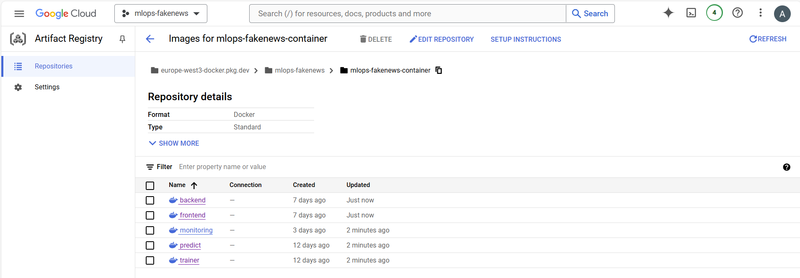

# Exam template for 02476 Machine Learning Operations

This is the report template for the exam. Please only remove the text formatted as with three dashes in front and behind
like:

```--- question 1 fill here ---```

where you instead should add your answers. Any other changes may have unwanted consequences when your report is
auto-generated at the end of the course. For questions where you are asked to include images, start by adding the image
to the `figures` subfolder (please only use `.png`, `.jpg` or `.jpeg`) and then add the following code in your answer:

```markdown

```

In addition to this markdown file, we also provide the `report.py` script that provides two utility functions:

Running:

```bash
python report.py html
```

will generate a `.html` page of your report. After the deadline for answering this template, we will auto-scrape
everything in this `reports` folder and then use this utility to generate an `.html` page that will be your serve
as your final hand-in.

Running

```bash
python report.py check
```

will check your answers in this template against the constraints listed for each question e.g. is your answer too
short, too long, or have you included an image when asked to.

For both functions to work you mustn't rename anything. The script has two dependencies that can be installed with

```bash
pip install click markdown
```

## Overall project checklist

The checklist is *exhaustive* which means that it includes everything that you could do on the project included in the
curriculum in this course. Therefore, we do not expect at all that you have checked all boxes at the end of the project.

### Week 1

* [X] Create a git repository
* [X] Make sure that all team members have write access to the GitHub repository
* [X] Create a dedicated environment for you project to keep track of your packages
* [X] Create the initial file structure using cookiecutter
* [X] Fill out the `make_dataset.py` file such that it downloads whatever data you need and
* [X] Add a model file and a training script and get that running
* [X] Remember to fill out the `requirements.txt` file with whatever dependencies that you are using
* [X] Remember to comply with good coding practices (`pep8`) while doing the project
* [X] Do a bit of code typing and remember to document essential parts of your code
* [X] Setup version control for your data or part of your data
* [X] Construct one or multiple docker files for your code
* [X] Build the docker files locally and make sure they work as intended
* [X] Write one or multiple configurations files for your experiments
* [X] Used Hydra to load the configurations and manage your hyperparameters
* [X] When you have something that works somewhat, remember at some point to to some profiling and see if
      you can optimize your code
* [X] Use Weights & Biases to log training progress and other important metrics/artifacts in your code. Additionally,
      consider running a hyperparameter optimization sweep.
* [X] Use Pytorch-lightning (if applicable) to reduce the amount of boilerplate in your code

### Week 2

* [X] Write unit tests related to the data part of your code
* [X] Write unit tests related to model construction and or model training
* [X] Calculate the coverage.
* [X] Get some continuous integration running on the GitHub repository
* [X] Create a data storage in GCP Bucket for you data and preferable link this with your data version control setup
* [X] Create a trigger workflow for automatically building your docker images
* [X] Get your model training in GCP using either the Engine or Vertex AI
* [X] Create a FastAPI application that can do inference using your model
* [X] If applicable, consider deploying the model locally using torchserve
* [X] Deploy your model in GCP using either Functions or Run as the backend

### Week 3

* [X] Check how robust your model is towards data drifting
* [X] Setup monitoring for the system telemetry of your deployed model
* [X] Setup monitoring for the performance of your deployed model
* [X] If applicable, play around with distributed data loading
* [X] If applicable, play around with distributed model training
* [X] Play around with quantization, compilation and pruning for you trained models to increase inference speed

### Additional

* [X] Revisit your initial project description. Did the project turn out as you wanted?
* [X] Make sure all group members have a understanding about all parts of the project
* [X] Uploaded all your code to github

## Group information

### Question 1
> **Enter the group number you signed up on <learn.inside.dtu.dk>**
>
> Answer:

---

not applicable

---

### Question 2
> **Enter the study number for each member in the group**
>
> Example:
>
> *sXXXXXX, sXXXXXX, sXXXXXX*
>
> Answer:

---

Tobias Brock: 12651637

Anne Gritto: 11946974

Stefanie Schwarz: 12662420

---

### Question 3
> **What framework did you choose to work with and did it help you complete the project?**
>
> Recommended answer length: 100-200 words.
>
> Example:
> *We used the third-party framework ... in our project. We used functionality ... and functionality ... from the*
> *package to do ... and ... in our project*.
>
> Answer:

---

We used the third-party framework PyTorch, specifically leveraging Torch Lightning, in our project. We used functionality from PyTorch for defining and training neural network models, taking advantage of its flexible and efficient tensor operations. Torch Lightning provided a higher-level interface that simplified the process of training and validating our models, managing the boilerplate code and improving the reproducibility of our experiments.

The automatic handling of training loops, validation checks, and logging within Torch Lightning significantly accelerated our development process. We also utilized its built-in support for multi-GPU training and checkpointing, which ensured efficient use of computational resources and easy recovery of model states. Overall, using PyTorch and Torch Lightning allowed us to focus more on the core logic and experimentation aspects of the project, rather than the intricacies of model training, which greatly contributed to the successful completion of our project.

---

## Coding environment

> In the following section we are interested in learning more about you local development environment.

### Question 4

> **Explain how you managed dependencies in your project? Explain the process a new team member would have to go**
> **through to get an exact copy of your environment.**
>
> Recommended answer length: 100-200 words
>
> Example:
> *We used ... for managing our dependencies. The list of dependencies was auto-generated using ... . To get a*
> *complete copy of our development environment, one would have to run the following commands*
>
> Answer:

---

We used anaconda for managing our dependencies. The list of dependencies was partly auto-generated by pipreqs for packages that are imported explicetly. Other implecitly called dependencies are added manually to the `requirements.txt` file. This ensured that all necessary packages and their versions were accurately captured for reproducibility.
To get a complete copy of our development environment, one would have to run the following commands:

```bash

% Create a new Anaconda environment with Python 3.11:

conda create -n mlops python==3.11

% Activate the newly created environment:

conda activate mlops

% Install all packages from requirements.txt and additional

pip install -r requirements.txt

pip install nvgpu

% Install the project dependencies:

pip install -e .

```

---

### Question 5

> **We expect that you initialized your project using the cookiecutter template. Explain the overall structure of your**
> **code. Did you fill out every folder or only a subset?**
>
> Recommended answer length: 100-200 words
>
> Example:
> *From the cookiecutter template we have filled out the ... , ... and ... folder. We have removed the ... folder*
> *because we did not use any ... in our project. We have added an ... folder that contains ... for running our*
> *experiments.*
> Answer:

---

From the cookiecutter template cookiecutter-data-science, we filled out most of the provided folders and added a few additional ones for our project's specific needs. Specifically, we included the data, docker, and models folders to handle data storage, source code, and model definitions respectively. However, the references folder was not applicable to our simple model.

Additionally, we chose not to use setup.cfg because flake8 linting is handled by ruff. We also added a config folder to implement Hydra for configuration management, and a tests folder to facilitate unit testing and continuous integration through GitHub Actions. This structure ensures that our project is well-organized and maintains best practices for scalability and collaboration.

---

### Question 6

> **Did you implement any rules for code quality and format? Additionally, explain with your own words why these**
> **concepts matters in larger projects.**
>
> Recommended answer length: 50-100 words.
>
> Answer:

---

For code formatting we are using ruff. You can automatically format your code pep8 conform with:

`ruff format . # formats all files in directory, respectively`

`pre-commit run --all-files # as ruff linting and ruff formatter are used as precommit hooks`

Also every function requires a docstring in our repo.

This matters because of readability and mitigating having minor changes (as new lines at end of the script) during a commit. Having google doc strings in every function allows for facilitated code comprehension and is therefore a best practice.

---

## Version control

> In the following section we are interested in how version control was used in your project during development to
> corporate and increase the quality of your code.

### Question 7

> **How many tests did you implement and what are they testing in your code?**
>
> Recommended answer length: 50-100 words.
>
> Example:
> *In total we have implemented X tests. Primarily we are testing ... and ... as these the most critical parts of our*
> *application but also ... .*
>
> Answer:

---

In total we have implemented 39 tests. We are testing the data part of the project, especially with `make_dataset.py` and `preprocessing.py`, and the model related part, which is aiming at the `model.py` and `train_model.py`. The other scripts of the module are mainly consisting of the one function, which is highly entangeled with other services like wandb. The testing is more complex here, since this functionality has to be mocked and can't be tested. Additionally, we wrote two test files for integration test of the inference and monitoring app. We also allow load testing for inference backend using locust.

---

### Question 8

> **What is the total code coverage (in percentage) of your code? If you code had an code coverage of 100% (or close**
> **to), would you still trust it to be error free? Explain you reasoning.**
>
> Recommended answer length: 100-200 words.
>
> Example:
> *The total code coverage of code is X%, which includes all our source code. We are far from 100% coverage of our **
> *code and even if we were then...*
>
> Answer:

---

The total code coverage of our code is 75%, which includes `fakenews\config.py`, `fakenews\data\make_dataset.py`, `fakenews\data\preprocessing.py`, `fakenews\model\model.py`, `fakenews\model\train_model.py`, and all related init and test files. While we strive for higher coverage, achieving 100% coverage is challenging due to the complexity and interactions of advanced functions, many of which are wrapped within other functions, making them difficult to test in isolation.

Even if we were to reach 100% code coverage, it would not necessarily guarantee that the code is error-free. Code coverage metrics indicate how much of the code is executed during testing, but they do not guarantee the absence of logical errors, edge cases, or unforeseen interactions. It is crucial to complement high code coverage with comprehensive testing strategies, including integration tests, system tests, and manual testing, to ensure the robustness and reliability of the software.

---

### Question 9

> **Did you workflow include using branches and pull requests? If yes, explain how. If not, explain how branches and**
> **pull request can help improve version control.**
>
> Recommended answer length: 100-200 words.
>
> Example:
> *We made use of both branches and PRs in our project. In our group, each member had an branch that they worked on in*
> *addition to the main branch. To merge code we ...*
>
> Answer:

---

We made use of both branches and pull requests (PRs) in our project. Each member of our group created their own branches to work on distinct features, ensuring isolated development environments. From an early stage of the project, every branch was merged into the main branch exclusively through PRs, which were reviewed by another team member. This practice underscored the importance of the "Zwei-Augen-Prinzip" (two-eyes principle), ensuring that code quality was consistently improved through peer reviews.

Although we aimed to include main branch protection rules to enforce this practice through GitHub, our private account did not support this feature. Nonetheless, we implemented continuous integration with unit tests and pre-commit checks as a form of branch protection, ensuring that only thoroughly vetted code was integrated into the main branch. This workflow significantly improved our version control process, maintaining code quality and reducing integration issues.

---

### Question 10

> **Did you use DVC for managing data in your project? If yes, then how did it improve your project to have version**
> **control of your data. If no, explain a case where it would be beneficial to have version control of your data.**
>
> Recommended answer length: 100-200 words.
>
> Example:
> *We did make use of DVC in the following way: ... . In the end it helped us in ... for controlling ... part of our*
> *pipeline*
>
> Answer:

---

We did make use of DVC in the following way: Initially, we integrated DVC with Google Drive to store our version-controlled data as hashed files. By doing so, we only needed to push the data.dvc file to GitHub and tag the current data version. Later, we updated our setup to pull/push DVC data to Google Cloud Buckets for better scalability and access workflows.

We decided to version control the entire data folder with DVC to ensure we tracked all changes and avoided any inconsistencies between data files. In the end, DVC helped us manage storage space efficiently by preventing redundant data uploads and downloads. It also enabled us to control and document changes in our dataset continuously. This was particularly beneficial for our pipeline, as it ensured reproducibility and allowed team members to work with consistent and accurate versions of the data across different stages of the project.

---

### Question 11

> **Discuss you continuous integration setup. What kind of continuous integration are you running (unittesting,**
> **linting, etc.)? Do you test multiple operating systems, Python  version etc. Do you make use of caching? Feel free**
> **to insert a link to one of your GitHub actions workflow.**
>
> Recommended answer length: 200-300 words.
>
> Example:
> *We have organized our continuous integration into 3 separate files: one for doing ..., one for running ... testing*
> *and one for running ... . In particular for our ..., we used ... .An example of a triggered workflow can be seen*
> *here: <weblink>*
>
> Answer:

---

We have organized our continuous integration (CI) into three separate files: one for code formatting and linting with Ruff, one for running a Docker image on pull requests (PRs), and one for testing. This setup ensures that our codebase remains clean, our data is accurately tested, and our deployment process is streamlined.

1. Code Formatting and Linting
For code formatting and linting, we use Ruff. This workflow runs on every push and PR to ensure that our code adheres to the style guidelines and is free from common errors. This helps maintain code quality and consistency across the team.

2. Unit Testing and Data Validation
Our unit tests are divided into various components, with a specific focus on the data part. We use a DVC workflow to test the current version of the data associated with the PR. This setup used to require storing Google Drive credentials in GitHub secrets, allowing us to pull the correct data version and run the tests accordingly. Currently, the dvc is connected to a Google Cloud Bucket.

3. Docker Image Build and Deployment
We have a workflow that triggers on PRs to the main branch. This workflow builds a Docker image for training on Google Cloud Build and saves it at the Artifact Registry, as well as a docker image for backend, frontend and moitoring, including deployment.

4. Example Workflow
An example of a triggered workflow can be seen in our "Run test" workflow. This workflow ensures that all rests are con successfully before merging a PR.

Example GitHub Actions Workflow: https://github.com/StefanieSwz/fake-news-classification/blob/main/.github/workflows/tests.yaml

---

## Running code and tracking experiments

> In the following section we are interested in learning more about the experimental setup for running your code and
> especially the reproducibility of your experiments.

### Question 12

> **How did you configure experiments? Did you make use of config files? Explain with coding examples of how you would**
> **run a experiment.**
>
> Recommended answer length: 50-100 words.
>
> Example:
> *We used a simple argparser, that worked in the following way: Python  my_script.py --lr 1e-3 --batch_size 25*
>
> Answer:

---

We used a simple argparser, configured as follows:

```bash

python fakenews/model/train_model.py --model.dropout_rate=0.2 --train.batch_size=16

% or using Makefile for convenience

make train ARGS=”train.epochs=5 train.lr=0.01”

```

Our script is fully automated with make commands, and all configurations are managed by Hydra, with default settings stored in the config folder as YAML files. Additionally, we can modify Hydra configs when running Docker containers locally:

```bash

docker build -f docker/trainer_local.dockerfile . -t trainer:latest

% if you are using windows command line

docker run --name <container_name> -v %cd%/models:/models/ trainer:latest train.local_data=True train.local_wandb=True <model.dropout_rate=0.3 train.batch_size=8>

```

---

### Question 13

> **Reproducibility of experiments are important. Related to the last question, how did you secure that no information**
> **is lost when running experiments and that your experiments are reproducible?**
>
> Recommended answer length: 100-200 words.
>
> Example:
> *We made use of config files. Whenever an experiment is run the following happens: ... . To reproduce an experiment*
> *one would have to do ...*
>
> Answer:

---

We made use of config files to ensure the reproducibility of our experiments. Whenever an experiment is run, the following steps occur:

1. Config Management: Configurations can be changed via command line inputs, and the used configs are automatically stored in the `outputs/` folder. Each experiment's folder is named according to the date and time it was run and includes the configs, Hydra settings, and override YAML files.

2. Logging and Tracking: We save all logged parameters using Weights & Biases (wandb). This includes detailed records of the hyperparameters, metrics, and results.

3. Docker for Reproducibility: Docker containers are used to ensure that the environment remains consistent across different runs. The Docker files are version-controlled and stored, making it easy to reproduce the exact environment in which the experiments were conducted.

To reproduce an experiment, one would simply need to:

- Retrieve the relevant config files from the `outputs/` folder or from wandb logs.
- If preferred, use the Docker container to ensure the same environment.
- Run the experiment using the stored configurations.

---

### Question 14

> **Upload 1 to 3 screenshots that show the experiments that you have done in W&B (or another experiment tracking**
> **service of your choice). This may include loss graphs, logged images, hyperparameter sweeps etc. You can take**
> **inspiration from [this figure](figures/wandb.png). Explain what metrics you are tracking and why they are**
> **important.**
>
> Recommended answer length: 200-300 words + 1 to 3 screenshots.
>
> Example:
> *As seen in the first image when have tracked ... and ... which both inform us about ... in our experiments.*
> *As seen in the second image we are also tracking ... and ...*
>
> Answer:

---

- The first image provides an overview of the total number of runs that were performed. However, many of those runs were not completed or did not necessarily include model training, for example, when downloading an artifact from the model registry.


Failed training runs can be credited to adjustments in the code during development or manually stopped runs.
In total 12 metrics are considered for an entire training run:

```bash

  - dropout rate

  - learning rate

  - batch size

  - epoch

  - training loss per 50 steps

  - training accuracy per 50 steps

  - training loss at the end of each epoch

  - training accuracy at the end of each epoch

  - validation loss at the end of each epoch

  - validation accuracy at the end of each epoch

  - test loss

  - test accuracy

```

- The second image provides an overview of the hyperparameter optimization sweep using random search that was performed to obtain the best model that is later staged as such in the model registry.
One can observe that the learning rate has the highest importance with respect to the validation loss, which was selected as a tuning criterion to prevent test set bias. Especially lower learning rates achieve lower validation loss at the end of the training periods.


- The third image is an overview of the model registry. Only the five models created by the hyperparameter optimization sweep were added to the model registry. However, artifacts can be added automatically by using a make command.


Moreover, the best model in the registry is then flagged based on the lowest validation loss at the end of the training period, denoted by VAL_LOSS in the picture.

---

### Question 15

> **Docker is an important tool for creating containerized applications. Explain how you used docker in your**
> **experiments? Include how you would run your docker images and include a link to one of your docker files.**
>
> Recommended answer length: 100-200 words.
>
> Example:
> *For our project we developed several images: one for training, inference and deployment. For example to run the*
> *training docker image: `docker run trainer:latest lr=1e-3 batch_size=64`. Link to docker file: <weblink>*
>
> Answer:

---

For our project, we developed several Docker images: one for training, one for inference, and one for deployment. This approach ensured a consistent environment across different stages of our workflow.

To run the training Docker image locally, we use the following commands:

```bash

docker build -f docker/trainer_local.dockerfile . -t trainer:latest

docker run --name <container_name> -v %cd%/models:/models/ trainer:latest train.local_data=True train.local_wandb=True <model.dropout_rate=0.3 train.batch_size=8>

```

This setup mounts the models folder to save the weights locally, allowing us to persist the trained models outside of the container.

For running the training via Google VERTEX AI, we have seperate docker files and we do not mount the folder, as these platforms handle storage differently.

By using Docker, we ensured that our experiments were reproducible and could be easily shared with team members or deployed to different environments without compatibility issues.

Link to the trainer Docker file (for cloud usage): https://github.com/StefanieSwz/fake-news-classification/blob/main/docker/trainer.dockerfile

---

### Question 16

> **When running into bugs while trying to run your experiments, how did you perform debugging? Additionally, did you**
> **try to profile your code or do you think it is already perfect?**
>
> Recommended answer length: 100-200 words.
>
> Example:
> *Debugging method was dependent on group member. Some just used ... and others used ... . We did a single profiling*
> *run of our main code at some point that showed ...*
>
> Answer:

---

Debugging methods varied among group members. Some members preferred normal code commenting and debugging through error messages, while others utilized the Python debugger (pdb) through command line and breakpoints for a more interactive approach. These methods helped us identify and resolve issues efficiently.

We also performed basic profiling of our main code to ensure there were no major runtime issues. This profiling revealed that, apart from the expected training time for the neural network, no significant performance bottlenecks were present. The extended training time was primarily due to resource limitations on local laptops and was not indicative of code inefficiencies. Additionally, using PyTorch Lightning, known for its well-structured classes and methods, further assured us of the performance and reliability of our codebase.

---

## Working in the cloud

> In the following section we would like to know more about your experience when developing in the cloud.

### Question 17

> **List all the GCP services that you made use of in your project and shortly explain what each service does?**
>
> Recommended answer length: 50-200 words.
>
> Example:
> *We used the following two services: Engine and Bucket. Engine is used for... and Bucket is used for...*
>
> Answer:

---

We used the following services:

- **Buckets** in the Cloud Storage with object versioning to store the data and best model weights.

- **Artifact registry** where the docker images are stored and we set up a **Trigger** to use continuous integration, i.e. the Trigger automatically starts the building process of an image each time we push code to the repository.

- **Vertex AI** to train the model on CPUs. With Vertex AI, we can create custom jobs and use the docker containers that have everything to run our code. Although it is also possible to train on a GPU using Vertex AI, we did not get an approval to increase quota.

- **Compute Engine** to train the model on both, CPUs and GPUs. To train with a GPU, we used a Nvidia T4 GPU with a public deep learning image that has Python 3.10 and CUDA 12.1 preinstalled. The training on a CPU uses an `e2-standard-4` as machine type.

- **Cloud Run** to deploy the model with a frontend and backend application and the monitoring FastAPI app.

- **Secret Manager** to store Weights and Biases API key to make code runnable in the Cloud.

---

### Question 18

> **The backbone of GCP is the Compute engine. Explained how you made use of this service and what type of VMs**
> **you used?**
>
> Recommended answer length: 100-200 words.
>
> Example:
> *We used the compute engine to run our ... . We used instances with the following hardware: ... and we started the*
> *using a custom container: ...*
>
> Answer:

---

We used the Google Cloud Compute Engine to run our training experiments, utilizing both CPU and GPU virtual machine (VM) instances tailored to our specific needs.

For GPU-based training, we selected an image with Nvidia drivers and PyTorch (`c0-deeplearning-common-cu121-v20240627-debian-11-py310`). We created a VM with `n1-standard-8` machine type and 100GB of storage. Upon starting the VM, we were prompted to install the Nvidia driver by typing y when asked: `install nvidia driver?[y/n]`. This setup provided us with pre-installed Git, nvidia-smi, and conda, ensuring a smooth environment for our deep learning tasks.

For CPU-based training, we utilized the `e2-standard-4` machine type. This instance type offered a balance of performance and cost, suitable for less computationally intensive tasks. All necessary frameworks had to be installed from scratch via terminal, as no specific compute image was selected.

 ---

### Question 19

> **Insert 1-2 images of your GCP bucket, such that we can see what data you have stored in it.**
> **You can take inspiration from [this figure](figures/bucket.png).**
>
> Answer:

---

Buckets for storing data and model weights:


---

### Question 20

> **Upload one image of your GCP artifact registry, such that we can see the different images that you have stored.**
> **You can take inspiration from [this figure](figures/registry.png).**
>
> Answer:

---

Images of training, predicting as well as deployment of backend and frontend:



---

### Question 21

> **Upload one image of your GCP cloud build history, so we can see the history of the images that have been build in**
> **your project. You can take inspiration from [this figure](figures/build.png).**
>
> Answer:

---

Build history with images triggered from local and by pushing into the repository:


---

### Question 22

> **Did you manage to deploy your model, either in locally or cloud? If not, describe why. If yes, describe how and**
> **preferably how you invoke your deployed service?**
>
> Recommended answer length: 100-200 words.
>
> Example:
> *For deployment we wrapped our model into application using ... . We first tried locally serving the model, which*
> *worked. Afterwards we deployed it in the cloud, using ... . To invoke the service an user would call*
> *`curl -X POST -F "file=@file.json"<weburl>`*
>
> Answer:

---

For deployment we wrapped our model into application using FastAPI. We first deployed the model locally. Afterwards we deployed it in the cloud, using Cloud Run.

Local deployment using FastAPI as backend (and for monitoring) and streamlit as frontend:
      - backend and monitoring:
bash
      uvicorn fakenews.app.inference_app:app --reload
      uvicorn fakenews.app.monitoring_app:app --reload

      - frontend:
bash
      streamlit run fakenews/app/frontend.py

curl commands can also be used for requesting the API. However, one may deem the frontend as more convenient.

An example for requesting the inference app deployed locally on port 8000:
bash
      curl -X POST "http://localhost:8000/predict_single/" \
     -H "Content-Type: application/json" \
     -d '{"title": "Example news title"}'

Cloud deployment using Cloud Run and Cloud Build:
bash
      gcloud builds submit --config=config/cloudbuild_<name>.yaml

This will automatically build the image, push it to the cloud and deploy the service, including frontend, backend and monitoring.

These are the URLS to open the deployed services:
      - frontend: https://frontend-awan6kp5bq-ey.a.run.app
      - backend: https://backend-awan6kp5bq-ey.a.run.app
      - monitoring: https://monitoring-awan6kp5bq-ey.a.run.app

Curl requests can be sent analogously.


---

### Question 23

> **Did you manage to implement monitoring of your deployed model? If yes, explain how it works. If not, explain how**
> **monitoring would help the longevity of your application.**
>
> Recommended answer length: 100-200 words.
>
> Example:
> *We did not manage to implement monitoring. We would like to have monitoring implemented such that over time we could*
> *measure ... and ... that would inform us about this ... behaviour of our application.*
>
> Answer:

---

We implemented monitoring for data drift of our textual data (also in form of their embedding values) and label distribution coming from a reference database and a monitoring database originating from our inference app. The report can be accessed via a FastAPI application that creates reports and also downloads them.

For the inference app, we collect a broad set of metrics via the prometheus package. Most of the metrics are coming from a default setting, and one metric (number of made predictions) is manually implemented via incremention steps. If wished, the metrics can be accessed through a `metrics/` endpoint in our inference FastAPI app.

On Google Cloud Platform, we tested the usability of the Monitoring Dashboard and created a widget for the CPU utilization and GPU RAM usage.
We also created an alert system for a heavy request load to our Google Cloud Buckets, which was triggered once for now.

We added SLO to the Cloud Run "backend" to check the latency of the response, requiring that 80% of reponses must be completed in max 5 seconds. We are also able to stress test our API using locust, spawning multiple users and requests at the same time.

 ---

### Question 24

> **How many credits did you end up using during the project and what service was most expensive?**
>
> Recommended answer length: 25-100 words.
>
> Example:
> *Group member 1 used ..., Group member 2 used ..., in total ... credits was spend during development. The service*
> *costing the most was ... due to ...*
>
> Answer:

---

In total, we spent 33.30 Euro (11th July 2024 at 4pm) for data and model storage (Buckets), Artifact registry, model training (Vertex AI and Compute Engine) and model deployment and inference (Cloud Run). The service costing the most was the Compute Engine due to the training of the model on a GPU.

---

## Overall discussion of project

> In the following section we would like you to think about the general structure of your project.

### Question 25

> **Include a figure that describes the overall architecture of your system and what services that you make use of.**
> **You can take inspiration from [this figure](figures/overview.png). Additionally in your own words, explain the**
> **overall steps in figure.**
>
> Recommended answer length: 200-400 words
>
> Example:
>
> *The starting point of the diagram is our local setup, where we integrated ... and ... and ... into our code.*
> *Whenever we commit code and push to github, it auto triggers ... and ... . From there the diagram shows ...*
>
> Answer:

---


The starting point of the diagram is our local development setup, where we utilize VSCode as our integrated development environment (IDE) and Conda for managing our Python dependencies. Our machine learning model development is facilitated through PyTorch and PyTorch-Lightning, which streamline the training process. Configuration management is handled using Hydra, while WandB is used for experiment tracking and visualization.

Code changes are managed using Git and pushed to GitHub. The structure of our GitHub repository was initialized with the Data Science template by Cookiecutter. For data version control, we use DVC to track data and model versions. Whenever code is committed and pushed to main, it triggers our Continuous Integration (CI) pipeline via GitHub Actions. This pipeline performs automated checks including code style validation with pep8, unit testing to ensure code reliability, and pre-commit hooks to enforce coding standards. Additionally, API testing is conducted to verify the functionality of our endpoints.

Docker is employed both locally and in the Google Cloud to containerize our applications and ensure consistency across different environments. Code changes in main trigger Cloud Build, which automates the building process of different Docker images, specifically the images training, predicting, frontend, backend and monitoring. Docker images are then pushed to Google Cloud’s Artifact Registry. For model and data storage as well as data version control, we use GCS Buckets. The Compute Engine and Vertex AI are used for training our models. While the Compute Engine can be used for training on a CPU and GPU (T4), we only trained the model on a CPU in Vertex AI.

Our model deployment process also leverages Google Cloud Platform (GCP) services, specifically Cloud Run. In the deployment process, FastAPI serves as the backend framework, providing a robust API for model inference, and Streamlit is used for creating an interactive frontend application. Additionally, we implement data drift detection and telemetry to continuously track model performance and ensure its reliability over time. GCP Logging is utilized to monitor logs, errors, and system performance.

We further experimented with scalable inference, performing quantization, pruning and distillation. Especially pruning and distillation, utilizing a smaller DistilBert model with reduced finetuning layer size yielded drastic improvements in inference speed with almost no loss in performance. See: https://github.com/StefanieSwz/fake-news-classification/blob/main/notebooks/distillation.ipynb

In summary, our architecture integrates many tools and services to facilitate a development, deployment, and monitoring pipeline, ensuring an efficient and scalable machine learning solution.

---

### Question 26

> **Discuss the overall struggles of the project. Where did you spend most time and what did you do to overcome these**
> **challenges?**
>
> Recommended answer length: 200-400 words.
>
> Example:
> *The biggest challenges in the project was using ... tool to do ... . The reason for this was ...*
>
> Answer:

---

The biggest challenge we encountered during this project was effectively using Google Cloud Platform (GCP) services. This encompassed a range of tasks from cloud build automation to model training and deployment.

One significant struggle was setting up Cloud Build and the Trigger workflow such that Docker images are built when pushing to the repository. Our project required the use of API keys, such as those for WandB, and large data files which were both not stored in the GitHub repository. However, GCP needs to acces both to create most images. We addressed this by using Google Cloud Secrets Manager to securely store API keys and credentials. Additionally, we set up GCP Buckets to manage and load data dynamically, ensuring that the sensitive information remained protected and not hardcoded into the GitHub repository.

Training our models in a Virtual Machine (VM) presented another challenge, particularly related to resource management. Our initial configuration had the VM on Compute Engine set with only 3.7 GB of RAM. This limited memory led to frequent crashes during the training process, which was frustrating and difficult to diagnose. It took considerable time to pinpoint the issue through the logs. We resolved this by increasing the VM’s RAM to a more appropriate level for our model’s requirements. It was also a tedious task to re-apply for a GPU in different locations over and over again, since many Quota increase requests got denied.

---

### Question 27

> **State the individual contributions of each team member. This is required information from DTU, because we need to**
> **make sure all members contributed actively to the project**
>
> Recommended answer length: 50-600 words.
>
> Example:
> *Student sXXXXXX was in charge of developing of setting up the initial cookie cutter project and developing of the*
> *docker containers for training our applications.*
> *Student sXXXXXX was in charge of training our models in the cloud and deploying them afterwards.*
> *All members contributed to code by...*
>
> Answer:

---

All together: Initial Project proposal, Initial cookie cutter template and git repo

Stefanie Schwarz:

GitHub owner, set up DVC and Google Drive, managed access rights, created the initial Makefile, reviewed PRs for almost all branches, created Docker images for training and prediction, checked the profiling of PyTorch Lightning, wrote a large portion of tests for data, preprocessing, model, and training. Set up secrets for continuous integration, wrote the DVC workflow for testing, as well as the Docker trigger workflow in actions. Set up GCP project, IAM roles, and different Compute Engine instances with the setup of used packages and selected the appropriate images. Set up branch protection rules, tested deployment with TorchServe, monitored data drifting with Evidently and implemented initial FastAPI for monitoring. Implemented telemetry with Prometheus, set up monitoring in GCP with a Dashboard overview, enabled distributed data loading, attempted to calculate FLOPS during training and searched for alternative packages after failed execution. Informed the team about PyTorch quantization limitations, implemented pruning in model callbacks and tested functionality, updated MkDocs documentation, updated README for final project description, and wrote a large part of the report.

Tobias Brock:

Create files for preprocessing, model structure (torch lightning), training and data simulation for prediction. Allow distributed model training and profiling naturally with torch lightning setup. Create hydra setup for experiment tracking. Setup wandb team and experiment tracking for training, also setup sweep for hyperparameter optimization with random search. Create script to automatically sort models into the model registry of wandb that are saved as artifacts. Setup FastAPI application for model inference and update monitoring FastAPI app to load monitoring data into the cloud and offer different get options. Create setup for local deployment with torchserve (deprecated as it only supports nvidia GPUs). Create frontend for FastAPI inference, backend and setup dockerfiles with cloudbuild for frontend, backend and monitoring. Deploy frontend, backend (inference) as Cloud Run in Google Cloud Services and monitoring FastAPI. Calculate FLOPS of original model and perform quantization. Create notebooks for initial visualization of length distribution of titles, test set predictions and comparison of regular best model with quantized model. Create SLOs in the cloud for the performance of the backend. Setup pruning in the sweep to be included in the hyperparameter optimization. Create API tests for both FastAPI apps and also create locust file to check API loading. Create training script for model distillation training using the best model from the cloud. Setup distillation model file, including classes for "distilbert-base-uncased" and "albert-base-v2" and distillation training class using teacher and student model. Create benchmarking file to compare inference speed, FLOPS and test performance of models. Also setup notebook with corresponding plots.

Anne Gritto:

Set up the data workflow from Kaggle, established continuous integration, configured Ruff, and contributed to unit tests for data and model training. Implemented GitHub Actions workflow with integrated unit tests and code formatting, activated pre-commit hooks, set up service accounts, and created buckets in GCS for data and model storage. Linked buckets to DVC, set up Docker containers in Artifact Registry, and created trigger workflows in GCP related to GitHub repository pushes. Trained the model locally and on Vertex AI using a CPU, automatically saved the best model in a GCS Bucket, and created secrets in Google Cloud Secret Manager for WandB keys and service account credentials. Managed access to secrets during training and deployment, deployed the model in Google Cloud, contributed to documentation using MkDocs, and wrote part of the project report.

---
